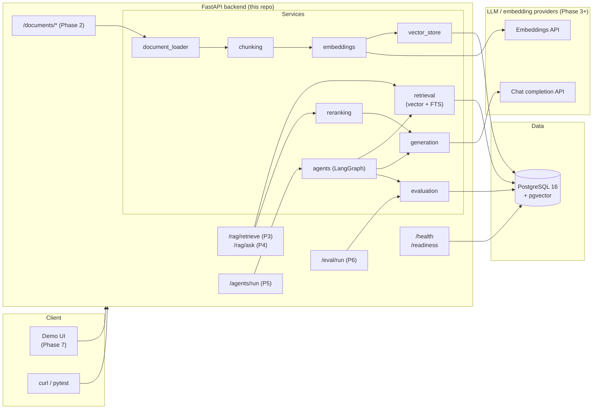
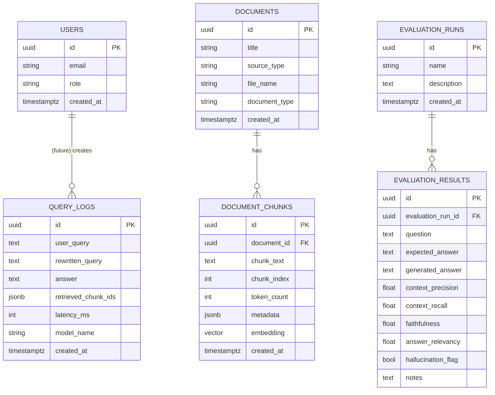

# 02 — Architecture

This document describes the architecture *as of Phase 1* and how it
evolves over later phases. Every box that doesn't exist yet is labeled
with the phase that introduces it.

## High-level system diagram



## Component responsibilities

### FastAPI app (`backend/app/`)

The single backend service. It owns:

- HTTP layer (`app/api/routes_*.py`).
- Validation / serialization (`app/schemas/*.py`).
- Domain logic (`app/services/*.py`).
- Persistence (`app/db/*.py`).

A **layered** structure: routes call services, services call db. We avoid
the inverse — db never imports services, services never import routes —
so dependency direction stays one-way and testing is easy.

### PostgreSQL + pgvector

A single Postgres instance handles **both** relational data (documents,
chunks, query logs, evaluation runs) **and** vectors via the `pgvector`
extension. Two reasons:

1. **Simplicity.** One database is one fewer thing to operate. We can
   always graduate to a dedicated vector DB (e.g. Vertex AI Vector
   Search, Pinecone) later by swapping the `vector_store` service.
2. **Transactional ingestion.** Inserting a row in `documents`, its
   `document_chunks`, and the embedding vectors in one transaction
   means we never have orphaned chunks if anything fails halfway.

The Phase 3 migration adds an IVFFLAT index on `document_chunks.embedding`
(once we've picked a distance metric).

### LLM / embedding providers (Phase 3+)

The system is provider-agnostic. `EMBEDDING_PROVIDER` and `LLM_PROVIDER`
environment variables select the backend at runtime:

- `mock` — deterministic vectors, no network. Default for tests / dev.
- `openai` — any OpenAI-compatible `/v1/embeddings` and `/v1/chat/completions`
  endpoint (works with OpenAI, vLLM, LM Studio, Ollama-OpenAI, etc.).
- `sentence-transformers` — local CPU model, no API calls.

This means the same image can be deployed in environments that disallow
external calls (use a local model) or environments that allow them (use
OpenAI / Vertex AI). The code never branches on the provider.

## Data model (Phase 1)



### Why these tables in Phase 1?

We define every table up front (even the ones we won't write to until
Phase 6) because:

- **Migrations stay linear.** Each phase adds *indexes / columns* to an
  existing table rather than introducing wholesale new schemas. Easier
  to reason about; easier to roll back.
- **Models stay stable.** The `RetrievedChunk` schema, `Citation`
  schema, etc., have a real table to reference. Less churn later.
- **Demo data can be loaded early.** A future seed step can drop
  synthetic documents in before Phase 2's upload endpoint exists.

## Request lifecycle (today)

```mermaid
sequenceDiagram
    autonumber
    Client->>FastAPI: GET /readiness
    FastAPI->>JsonLogger: log request_start
    FastAPI->>get_db(): yield Session
    FastAPI->>Postgres: SELECT 1
    Postgres-->>FastAPI: 1
    FastAPI-->>Client: 200 {"status": "ready"}
    FastAPI->>JsonLogger: log request_end
```

In Phase 9 we'll insert request-ID middleware between `Client` and
`FastAPI` so every log line carries a trace id, and we'll add a
`/metrics` endpoint for Prometheus-style scraping.

## Deployment topology (Phase 10)

Phase 1 only runs locally via Docker Compose:

```
┌──────────────┐      ┌───────────────────────────┐
│ docker compose │ ───► │ db (Postgres 16+pgvector) │
└──────────────┘      └───────────────────────────┘
       │
       └──► backend (FastAPI / uvicorn)
```

In Phase 10 we'll add notes for:

- **Cloud Run** for the backend (autoscales to zero; container image
  built by CI).
- **Cloud SQL for Postgres** with the `vector` extension enabled (or a
  managed Postgres elsewhere).
- **Secret Manager / equivalent** for `OPENAI_API_KEY` etc.
- **Artifact Registry** for the image.
- **GitHub Actions** for build + test + deploy.

## Why FastAPI (vs Flask / Django)?

- **First-class async + sync.** Heavy LLM calls in Phase 4–5 will benefit.
- **Pydantic everywhere.** Request/response validation comes for free,
  so the API and OpenAPI doc never drift from the code.
- **Automatic `/docs` + `/redoc`.** Saves us writing API examples for
  the README.
- **Small surface area.** Easier to read in one sitting than Django for
  a learning-oriented project.

Flask equivalents: routes → `Blueprint`s; dependency injection →
`flask.g` or a wrapper; schemas → `marshmallow` / `pydantic` manually.
Django equivalents: `ninja` or DRF for the API layer, but you carry the
rest of Django (admin, ORM, etc.) along even if you don't use them.

## Why pgvector first (vs Vertex AI Vector Search, Pinecone, ...)?

- **Zero new infrastructure.** It's an extension on the database we
  already need.
- **ACID with the rest of the schema.** Document + chunk + embedding
  insertions are one transaction.
- **Open source.** Easy to run in CI and locally.
- **Good enough up to ~millions of vectors** with HNSW indexing.

When the project grows beyond what pgvector can serve, the
`app/services/vector_store.py` interface is the single seam to swap.
